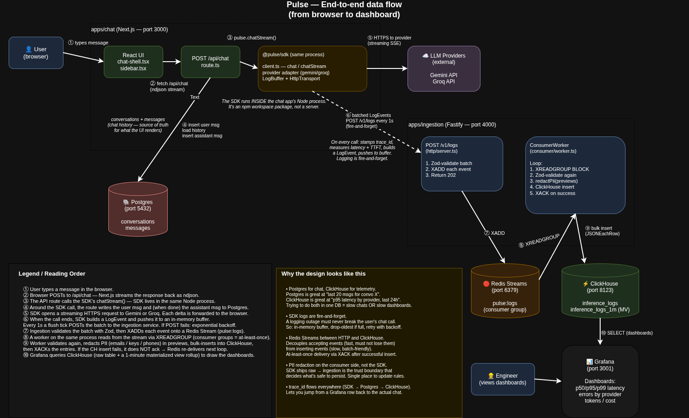

# Pulse — Architecture

This document walks through how Pulse is put together, end-to-end. Read this when you want to know **why** the code looks the way it does. For setup, see the top-level [README](../README.md).



> *Editable source: [architecture.drawio](./architecture.drawio) — open in [draw.io](https://app.diagrams.net) or the VS Code Draw.io extension. Re-export to `architecture.png` after edits.*

### Reading order

| # | Step |
|---|---|
| ① | User types a message in the browser. |
| ② | Browser POSTs to `/api/chat` — Next.js streams the response back as ndjson. |
| ③ | The API route calls the SDK's `chatStream()` — SDK lives in the same Node process. |
| ④ | Around the SDK call, the route writes the user msg and (when done) the assistant msg to Postgres. |
| ⑤ | SDK opens a streaming HTTPS request to Gemini or Groq. Each delta is forwarded to the browser. |
| ⑥ | When the call ends, SDK pushes a `LogEvent` to an in-memory buffer. Every 1s a flush tick POSTs the batch to ingestion. POST failure → exponential backoff. **Dashed arrow** because this is asynchronous — the chat request has already returned. |
| ⑦ | Ingestion Zod-validates the batch, then `XADD`s each event onto the Redis Stream. |
| ⑧ | A worker on the same process reads via `XREADGROUP` (consumer group = at-least-once delivery). |
| ⑨ | Worker re-validates, redacts PII (emails / keys / phones) in previews, bulk-inserts into ClickHouse, then `XACK`s. If the CH insert fails: do **not** ack → Redis re-delivers on the next loop. |
| ⑩ | Grafana queries ClickHouse (raw table + 1-minute materialized-view rollup) for the dashboards. |

### Why the design looks like this

- **Postgres for chat, ClickHouse for telemetry.** Postgres is great at *"last 20 messages for conversation X"* (random access). ClickHouse is great at *"p95 latency by provider over the last 24h"* (analytical scans over millions of rows). One DB for both = slow chats OR slow dashboards.
- **SDK logs are fire-and-forget.** A logging outage must never break the user's chat call. So: in-memory buffer, drop-oldest on overflow, retry the network with exponential backoff.
- **Redis Streams between HTTP and ClickHouse.** Decouples *accepting events* (fast, must not lose them) from *inserting events* (slow, batch-friendly). At-least-once delivery via `XACK` after a successful insert — if the worker crashes mid-insert, Redis re-delivers.
- **PII redaction on the consumer side, not in the SDK.** Ingestion is the trust boundary that decides what's safe to persist. One place to update rules.
- **`trace_id` flows everywhere** (SDK → Postgres `messages.trace_id` → ClickHouse `inference_logs.trace_id`). Lets you jump from a Grafana row back to the actual chat.

---

## 1. Components

```
┌──────────────────────────────────────────────────────────────────────────┐
│                          User-facing                                     │
│                                                                          │
│   apps/chat                 apps/grafana (provisioned dashboards)        │
│   Next.js 15                Grafana 11 + clickhouse-datasource           │
│   :3000                     :3001                                        │
└──────────┬─────────────────────────────────┬─────────────────────────────┘
           │                                 │
           │ SQL                             │ SQL (port 9000)
           ▼                                 ▼
┌──────────────────────┐         ┌──────────────────────────────────────┐
│  Postgres 16         │         │  ClickHouse 24.8                     │
│  (operational)       │         │  (analytics)                         │
│                      │         │                                      │
│  conversations       │         │  inference_logs (MergeTree)          │
│  messages            │         │  inference_logs_1m (SummingMT + MV)  │
│  :5432 (host 5433)   │         │  :8123 HTTP, :9000 native            │
└──────────────────────┘         └──────────▲───────────────────────────┘
           ▲                                │
           │ pg client                      │ INSERT (batched)
           │                                │
           │            ┌───────────────────┴─────────────────────────┐
           │            │  apps/ingestion (single Node process)       │
           │            │                                             │
           │            │   ┌────────────────┐    ┌────────────────┐  │
           │            │   │ Fastify        │    │ Redis Streams  │  │
           │            │   │ POST /v1/logs  │───▶│ consumer       │  │
           │            │   │ Zod validate   │    │ PII redact     │  │
           │            │   │ XADD           │    │ XREADGROUP     │  │
           │            │   │                │    │ batch INSERT   │  │
           │            │   │                │    │ XACK           │  │
           │            │   └─────────┬──────┘    └───────┬────────┘  │
           │            │             │ XADD              │           │
           │            │             ▼                   │           │
           │            │   ┌──────────────────┐          │           │
           │            │   │ Redis 7 Streams  │◀─────────┘           │
           │            │   │ key:             │  XACK                │
           │            │   │ pulse:           │                      │
           │            │   │   inference-logs │                      │
           │            │   └──────────────────┘                      │
           │            │   :6379                                     │
           │            └───────────▲─────────────────────────────────┘
           │                        │ HTTP POST
           │ pg writes              │ (ndjson batch)
           │                        │
┌──────────┴──────────────┐    ┌────┴───────────────┐
│ Next.js /api/chat       │    │ @pulse/sdk         │
│ - persists user message │───▶│ (imported by the   │
│ - calls pulse.chatStream│    │  chat app + any    │
│ - persists assistant    │    │  downstream Node)  │
│ - returns ndjson stream │    │                    │
└─────────────────────────┘    └─────────┬──────────┘
                                         │ HTTPS
                                         ▼
                          ┌─────────────────────────────┐
                          │   LLM provider (per call):  │
                          │   - generativelanguage.googleapis.com (Gemini)
                          │   - api.groq.com  (Groq)    │
                          └─────────────────────────────┘
```

Everything except the LLM provider runs locally via `docker compose up`.

---

## 2. The life of one chat turn

A user types `"hi"` and hits Send. Here is the full round-trip.

### 2.1 In the browser

[`apps/chat/src/components/chat-shell.tsx`](../apps/chat/src/components/chat-shell.tsx) — the client component owning chat state.

1. It optimistically appends two bubbles to `items`: the user's bubble with `id: "optimistic-user"`, and an empty assistant bubble with `id: "pending"`.
2. It opens `fetch("/api/chat", { signal })` with the AbortController. The signal lets `Stop` cancel the call.
3. It reads the response body via [`readFrames()`](../apps/chat/src/lib/stream-protocol.ts), an async generator that decodes JSON-lines.

### 2.2 In the Next.js route handler

[`apps/chat/src/app/api/chat/route.ts`](../apps/chat/src/app/api/chat/route.ts)

1. Validates the body with Zod.
2. Either `getConversation(id)` if `conversationId` was passed, or `createConversation()`. The title is derived from the first ~60 chars of the user message.
3. `INSERT` the user message row in Postgres.
4. Loads the full message history with `loadMessages(conversationId)` — single indexed scan on `(conversation_id, created_at)`.
5. Returns a `Response` whose body is a `ReadableStream` that we control.
6. Inside the stream:
   - Emit the `meta` frame (`conversationId`, `userMessageId`) — the client uses this to reconcile its optimistic user bubble.
   - Call `pulse.chatStream({ provider, model, messages, signal })`.
   - For each delta yielded by the SDK, emit a `delta` frame.
   - When the SDK emits its terminal `{done: true, response}`, INSERT the assistant message row (with `trace_id`) and emit `done`.
   - On any thrown error, persist whatever text we already streamed plus `"[interrupted]"` so the chat survives mid-stream failures, then emit an `error` frame.

The streaming protocol is documented in [`stream-protocol.ts`](../apps/chat/src/lib/stream-protocol.ts):

```
content-type: application/x-ndjson

{"type":"meta",  "conversationId":"…","userMessageId":"…"}
{"type":"delta", "text":"hi"}
{"type":"delta", "text":" there"}
{"type":"done",  "assistantMessageId":"…","traceId":"…","usage":{…}}
```

### 2.3 Inside @pulse/sdk

[`packages/sdk/src/client.ts`](../packages/sdk/src/client.ts)

1. Generates a `trace_id` (UUIDv4) **before** the upstream call — so we have a stable ID to log against even on error.
2. Records `startedAt = Date.now()`.
3. Dispatches to the right adapter — [Gemini](../packages/sdk/src/providers/gemini.ts) or [Groq](../packages/sdk/src/providers/groq.ts).
4. For streaming, measures TTFT at the **first non-empty delta** (not the first chunk — providers sometimes emit empty deltas).
5. Builds a `LogEvent` object whose field names are snake_case to match the ClickHouse columns 1:1.
6. Pushes it onto the in-memory buffer.
7. Returns the response to the caller (or yields the final stream frame).

The caller never awaits log delivery.

### 2.4 The SDK logger pipeline

[`packages/sdk/src/logger/buffer.ts`](../packages/sdk/src/logger/buffer.ts) — a bounded array (default cap 100). On overflow we evict the **oldest** event, not the newest. Reasoning: in a sustained outage, the freshest events tell you what just broke. Stale events from 30 seconds ago have already been superseded.

[`packages/sdk/src/logger/transport.ts`](../packages/sdk/src/logger/transport.ts) — `setInterval` ticks every 1s, drains up to 50 events, POSTs them as `{ events: [...] }` to the ingestion API.
- On 2xx → reset backoff to 1s.
- On any error → unshift events back to the front of the buffer, schedule next attempt with backoff (1s → 2s → 4s → … → 30s cap), swallow the exception.
- The timer uses `setInterval(...).unref()` so a Node CLI script using the SDK can still exit.

### 2.5 The ingestion service

`POST /v1/logs` ([`apps/ingestion/src/http/server.ts`](../apps/ingestion/src/http/server.ts)):
1. Zod-validates the batch against `logBatchSchema`. Caps batch size at 500, strings at 2000 chars.
2. For each event, `XADD pulse:inference-logs MAXLEN ~ 100000 * json <json-event>` — a single field named `json` per stream entry.
3. Returns `202 Accepted { accepted: N }`.

The HTTP response time is just "Redis ack time" (typically <5ms on loopback) — not "ClickHouse ack time". That's the whole point of the queue hop.

The consumer worker ([`apps/ingestion/src/consumer/worker.ts`](../apps/ingestion/src/consumer/worker.ts)) runs in the same Node process:
1. `XREADGROUP GROUP ingestion-workers <consumer-name> COUNT 100 BLOCK 2000 STREAMS pulse:inference-logs >`
2. For each entry, re-parse JSON, re-validate with Zod (defense in depth — a stale producer could XADD malformed entries).
3. Pass `input_preview` and `output_preview` through [`redactPii()`](../apps/ingestion/src/pii/redact.ts) which replaces emails / phones / API-keys / Bearer tokens / long digit runs with `[email]` / `[phone]` / `[token]` / `[number]`.
4. Bulk INSERT the batch into `inference_logs` via the official [`@clickhouse/client`](../apps/ingestion/src/clickhouse/client.ts), JSONEachRow format. We normalize ISO8601 timestamps to `YYYY-MM-DD HH:MM:SS.fff` because ClickHouse's `DateTime64` parser rejects the `T...Z` form.
5. `XACK` all successful entries in one variadic call.
6. **Poison-message policy:** if Zod fails, ACK and drop. Otherwise the entry would sit in the PEL forever and block progress.
7. **Insert-failure policy:** leave the batch un-ACKed; the next loop iteration retries it.

This gives **at-least-once delivery**. If we crash after a successful INSERT but before XACK, the entry gets re-delivered on the next boot and ClickHouse will have a duplicate row. We accept this because:
- `trace_id` is a unique UUID per call; dedup-on-query is `SELECT … GROUP BY trace_id`.
- Two-phase commit across Redis + ClickHouse doesn't exist.
- For analytics data, the rare duplicate is fine. For a payments queue you'd use a different design.

### 2.6 In ClickHouse

The row lands in `inference_logs`. Two columns are *not* set by the writer:
- `ingested_at` — `DEFAULT now64(3)` — system time of the insert. Combined with `timestamp` (event time from the SDK) this lets us compute ingestion lag, a real prod metric.
- `total_tokens` — `MATERIALIZED input_tokens + output_tokens` — stored on disk so dashboard panels don't recompute it.

The `inference_logs_1m_mv` materialized view fires synchronously on the insert and updates `inference_logs_1m`:
- Bucket by `toStartOfMinute(timestamp)`.
- `count()`, `sum(latency_ms)`, `sum(input_tokens)`, `sum(output_tokens)`, `sum(cost_usd)` per (provider, model, status).
- `quantilesTDigestState(0.5, 0.95, 0.99)(toFloat64(latency_ms))` — the **state** column, an `AggregateFunction` that stores a t-digest sketch. Reading the dashboard runs `quantilesTDigestMerge` to extract `[p50, p95, p99]` for each bucket.

The 1-minute rollup means Grafana never has to scan the raw 10M-row table when rendering the latency chart. The raw table powers detail panels (Recent Calls table) and is the source of truth.

### 2.7 In Grafana

[`infra/grafana/provisioning/datasources/datasources.yml`](../infra/grafana/provisioning/datasources/datasources.yml) wires the ClickHouse datasource with `uid: pulse-clickhouse` (pinned so dashboards reference it deterministically).

[`infra/grafana/provisioning/dashboards/pulse-overview.json`](../infra/grafana/provisioning/dashboards/pulse-overview.json) declares 8 panels, each with `rawSql` queries against either `inference_logs` (for "exact value over window" stats) or `inference_logs_1m` (for time-series at minute granularity).

The latency-quantile panel uses:
```sql
SELECT bucket AS t,
       arrayElement(quantilesTDigestMerge(0.5, 0.95, 0.99)(latency_quantile_state), 1) AS p50,
       arrayElement(quantilesTDigestMerge(0.5, 0.95, 0.99)(latency_quantile_state), 2) AS p95,
       arrayElement(quantilesTDigestMerge(0.5, 0.95, 0.99)(latency_quantile_state), 3) AS p99
FROM pulse.inference_logs_1m
WHERE $__timeFilter(bucket) AND status='success'
GROUP BY bucket ORDER BY bucket
```

`quantilesTDigestMerge` returns `Array(Float32)`; the panel needs scalar fields, so we destructure with `arrayElement`.

---

## 3. The two-DB split

| Read pattern | Postgres | ClickHouse |
|---|---|---|
| "Last 20 messages for chat X" | indexed scan O(20) | terrible — has to scan a partition |
| "How many active conversations does user Y have" | indexed scan | doesn't track conversation state |
| "p95 latency for gemini over the last hour" | sequential scan over messages, no compression | designed for this |
| "Token usage by model over the last week" | doesn't track tokens | one MV query, <100ms |
| Updates | YES — trigger bumps updated_at | inserts only (immutable rows) |
| Deletes | YES — cascade on conversation | TTL DROP PARTITION |
| Row count at scale | thousands | millions |

The bridge is `trace_id`:
- Postgres `messages.trace_id` references the assistant turn's ClickHouse row.
- ClickHouse `inference_logs.tags['conversation_id']` references the Postgres conversation.

A query like *"show me the chat that produced the slowest response in the last hour"* runs:
1. ClickHouse: `SELECT trace_id FROM inference_logs WHERE timestamp > now() - INTERVAL 1 HOUR ORDER BY latency_ms DESC LIMIT 1`
2. Postgres: `SELECT * FROM messages WHERE trace_id = $1`

Two cheap indexed lookups across two stores.

---

## 4. Failure modes

| Failure | What happens | Recovery |
|---|---|---|
| Provider returns 5xx | SDK throws, route handler emits `error` frame, log row written with `status='error'` and bucketed `error_code` | Caller retries with backoff |
| User closes the tab mid-stream | `req.signal.aborted = true` → SDK breaks out of provider iterator → log row written with `error_code='aborted'` | None needed |
| Ingestion service is down | SDK's buffer fills until 100 events; oldest start dropping. Per-call latency unaffected. | Ingestion comes back, buffer drains. |
| ClickHouse is down | Ingestion still XADDs to Redis; consumer's INSERT fails; entries stay un-ACKed. | CH comes back, consumer drains backlog. Redis Streams retains up to `MAXLEN ~ 100k`. |
| Redis is down | Ingestion's `XADD` throws; ingestion returns 503 to the SDK; SDK backs off and retries. | Redis comes back. Some events may have been dropped by the SDK's overflow cap. |
| Consumer crashes mid-batch | The batch's entries are still in the PEL assigned to the dead consumer name. | **Known gap**: no XAUTOCLAIM reclaim loop yet. A periodic claim-from-stale-consumers job belongs in production. |

---

## 5. Where to look in the code

When something breaks or you want to reason about behavior:

| Concern | File |
|---|---|
| How a chat turn is persisted | [`apps/chat/src/app/api/chat/route.ts`](../apps/chat/src/app/api/chat/route.ts) |
| How tokens stream to the browser | [`apps/chat/src/lib/stream-protocol.ts`](../apps/chat/src/lib/stream-protocol.ts) + [`chat-shell.tsx`](../apps/chat/src/components/chat-shell.tsx) |
| Why a log row didn't show up | [`packages/sdk/src/logger/transport.ts`](../packages/sdk/src/logger/transport.ts) (buffer) → [`apps/ingestion/src/http/server.ts`](../apps/ingestion/src/http/server.ts) (ingest) → [`worker.ts`](../apps/ingestion/src/consumer/worker.ts) (consumer) |
| Why a PII pattern didn't redact | [`apps/ingestion/src/pii/redact.ts`](../apps/ingestion/src/pii/redact.ts) |
| Why a Grafana panel is empty | The panel's `rawSql` in [`pulse-overview.json`](../infra/grafana/provisioning/dashboards/pulse-overview.json) + `system.query_log` in ClickHouse |
| Why the schema looks the way it does | Comments in [`infra/postgres/01_schema.sql`](../infra/postgres/01_schema.sql) and [`infra/clickhouse/01_schema.sql`](../infra/clickhouse/01_schema.sql) |
